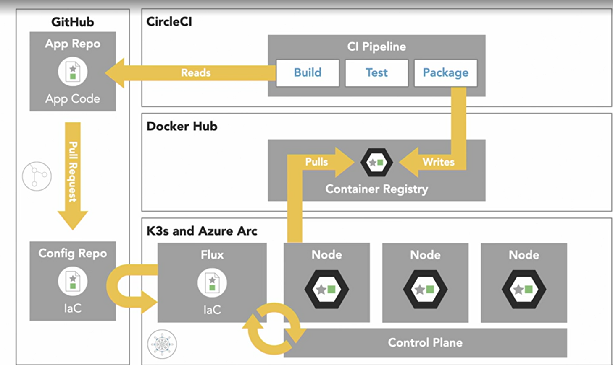

# GitOps Project with K3d, Azure Arc & FluxCD

## 📖 Overview
This repository follows a **GitOps** workflow to deploy a **Flask-based web application** using:
- **Local Kubernetes Cluster**: [`k3d`](https://k3d.io/) for lightweight cluster management
- **Cluster Management**: [`Azure Arc`](https://learn.microsoft.com/en-us/azure/azure-arc/kubernetes/) to integrate with Azure
- **GitOps CD Operator**: [`FluxCD`](https://fluxcd.io/) for automated deployments
- **CI/CD**: [`GitHub Actions`](https://github.com/features/actions) / [`CircleCI`](https://circleci.com/) for Continuous Integration
- **Containerization**: [`Docker`](https://www.docker.com/)

## Architecture


## 📂 Repository Structure
```
📦 gitOps-project
├── 📂 .github/workflows       # GitHub Actions CI/CD pipeline
├── 📂 env/arc_and_fluxCD      # Kubernetes manifests for FluxCD
├── 📂 env/cluster_config.yml  # Scripts for k3d cluster setup
├── 📂 app                     # Flask web application source code
│   ├── app.py
│   ├── templates/
│   ├── requirements.txt
│   ├── Dockerfile
│   └── README.md
└── README.md
```

## Planned changes
- Migrating from GitHub to Azure DevOps

## 🎯 Goals
✅ Automate infrastructure deployment using GitOps principles  
✅ Ensure reproducibility and consistency using **FluxCD**  
✅ Manage a local **k3d cluster** integrated with **Azure Arc**  
✅ CI/CD integration with **GitHub Actions** or **CircleCI**  
✅ Containerize the Flask app and deploy it to **Kubernetes**  

---

## 🛠️ Setup Instructions

### 1️⃣ Install Prerequisites
Ensure you have the following installed:
- **Docker**: [Install Docker](https://docs.docker.com/get-docker/)
- **K3d** (K3s in Docker): [Install K3d](https://k3d.io/#installation)
- **kubectl** (Kubernetes CLI): [Install kubectl](https://kubernetes.io/docs/tasks/tools/)
- **FluxCD**: [Install Flux](https://fluxcd.io/flux/installation/)
- **Azure CLI** (For Arc): [Install Azure CLI](https://learn.microsoft.com/en-us/cli/azure/install-azure-cli)

---

### 2️⃣ Setup a Local K3d Cluster
```sh
k3d cluster create gitops-cluster --servers 1 --agents 2 -p "8080:8080@loadbalancer"
kubectl get nodes  # Verify cluster is running
```

### 3️⃣ Connect K3d to Azure Arc
```sh
az login
az connectedk8s connect --name gitops-cluster --resource-group my-resource-group
```

### 4️⃣ Deploy FluxCD
```sh
flux bootstrap github \
  --owner=<GITHUB_USERNAME> \
  --repository=<GITHUB_REPO> \
  --path=./manifests \
  --personal
```

### 5️⃣ Deploy the Flask App
```sh
kubectl apply -f manifests/
```

---

## 🔄 CI/CD Pipeline
### **GitHub Actions (Optional)**
A GitHub Actions pipeline (`.github/workflows/deploy.yml`) is included to:
- Build & push the Docker image
- Update Kubernetes manifests
- Trigger a FluxCD sync

### **CircleCI (Optional)**
A `.circleci/config.yml` is also available for CircleCI integration.

To trigger deployments, push changes to the repository:
```sh
git add .
git commit -m "Deploy new version"
git push origin main
```

---

##  Access the Application
After deployment, access the Flask app via:
```sh
kubectl port-forward svc/webapp-service 8080:8080
```
Then visit:  
📌 [http://localhost:8080](http://localhost:8080)

---

##  Useful Commands
```sh
# Check FluxCD sync status
flux get all

# List running pods
kubectl get pods -n default

# View app logs
kubectl logs -l app=webapp
```
---

##  Contributing
Contributions are welcome! Feel free to submit a pull request.

---

##  Support
If you have any issues, open a GitHub Issue or contact me. 🚀

